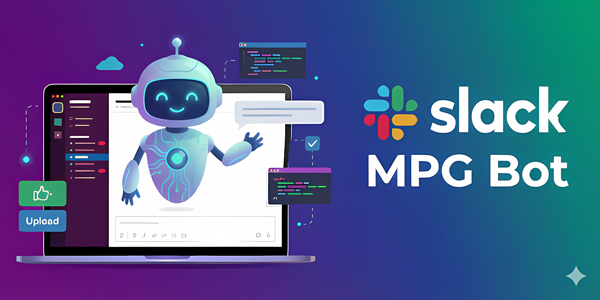
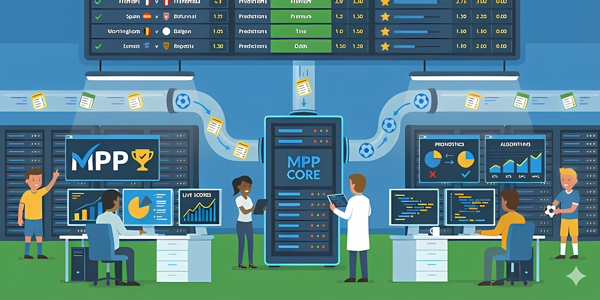

# Bienvenue chez LFP DIGITAL 👋

Nous construisons des solutions numériques pour le football professionnel.

## 🛠 Tech Stack
  

## 🧱 Backend & APIs

<table>
  <tr>
    <td width="33%" valign="top">
      
       
      <h3 align="center">
        <a href="https://github.com/LFP-DIGITAL/slack-worker">slack-worker</a>
      </h3>
      

         <code>TypeScript</code> · ⭐ 1
      

    </td>
    <td width="33%" valign="top">
      
       
      <h3 align="center">
        <a href="https://github.com/LFP-DIGITAL/mpp-back">mpp-back</a>
      </h3>
      

         <code>TypeScript</code>
      

    </td>
    <td width="33%" valign="top">
      
       
      <h3 align="center">
        <a href="https://github.com/LFP-DIGITAL/mpg-back">mpg-back</a>
      </h3>
      

         <code>TypeScript</code> · ⭐ 1
      

    </td>
  </tr>
</table>

## 💻 Frontend & Interfaces

*Aucun projet public dans cette catégorie pour le moment.*

## 🔧 Outils & Libs

*Aucun projet public dans cette catégorie pour le moment.*

---
*Dernière mise à jour automatique le : 11/12/2025*
